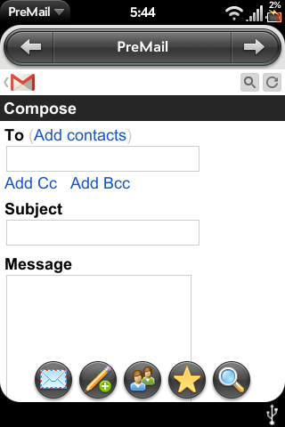

# PreMail

A simple Gmail app for Palm/HP webOS! (Works in 2021)

## Unfortunately, PreMail no longer works. Thank you to everyone who contributed.

- Created and maintained by [John Spahr](https://github.com/JohnSpahr).
- Auto updater, custom headers, and more by [codepoet80](https://github.com/codepoet80).
- I encourage you to reference this code if you are developing a webOS app and need some sample apps to look at.

### Install Instructions
1. Download PreMail and install it on your device using the [webOS Quick Install Utility](https://github.com/JayCanuck/webos-quick-install/releases).
2. Open up PreMail.
3. Trust certificate(s) when prompted.
4. Sign in!

### Testing
This application was tested on a Palm Pre and Pixi Plus, both running webOS 1.4.5, as well as a Palm Pre 2 running webOS 2.2.4.

### Screenshots

